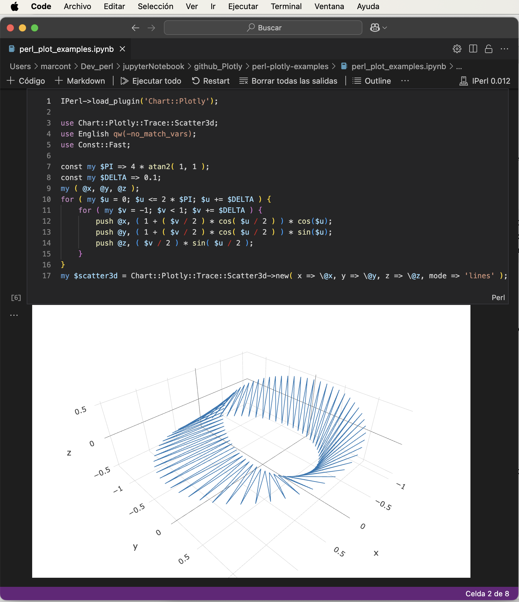

# Plotly Examples in Perl using iPerl (Jupyter)

This repository showcases interactive data visualization using Perl in Jupyter Notebooks through the iPerl kernel. It includes three examples that demonstrate how to generate web-based interactive plots with Plotly from Perl.

The notebook `perl_plot_examples.ipynb` was edited in **Visual Studio Code (VSCode)** using the [iPerl Jupyter kernel plugin](https://github.com/EntropyOrg/p5-Devel-IPerl).

## 📦 Requirements

- Perl 5.x
- [iPerl](https://metacpan.org/pod/IPerl) ([GitHub repo](https://github.com/EntropyOrg/p5-Devel-IPerl))
- JupyterLab or VSCode with Jupyter extension
- CPAN modules:
  - `Chart::Plotly`
  - `PDL`
  - `Dash` (optional, for advanced dashboards)

---

## 📈 Example 1: Simple Plot with Plotly

A basic interactive line plot using `Chart::Plotly::Plot`.

**Perl snippet:**
```perl
use Chart::Plotly qw(show_plot);
use Chart::Plotly::Plot;
use Chart::Plotly::Trace::Scatter;

my $trace = Chart::Plotly::Trace::Scatter->new(
    x => [0 .. 10],
    y => [ map { $_**2 } 0 .. 10 ],
    mode => 'lines+markers'
);

my $plot = Chart::Plotly::Plot->new(traces => [$trace]);
show_plot($plot);
```

---

## 🗺️ Example 2: Interactive Map with Scattermapbox

An interactive geographic plot using `Scattermapbox`. It shows points based on latitude/longitude.

**Perl snippet:**
```perl
use Chart::Plotly::Plot;
use Chart::Plotly::Trace::Scattermapbox;

my $trace = Chart::Plotly::Trace::Scattermapbox->new(
    lat  => ["-33.45"],
    lon  => ["-70.66"],
    mode => 'markers',
    marker => { size => 14 },
    text => ["Santiago"]
);

my $plot = Chart::Plotly::Plot->new(
    traces => [$trace],
    layout => {
        mapbox => { style => "open-street-map", center => { lat => -33.45, lon => -70.66 }, zoom => 5 },
        margin => { t => 0, b => 0, l => 0, r => 0 }
    }
);

Chart::Plotly::show_plot($plot);
```

---

## 🌐 Example 3: 3D Interactive Plot (Scatter3d)

Generates a 3D scatter plot with Plotly.

**Perl snippet:**
```perl
use Chart::Plotly::Plot;
use Chart::Plotly::Trace::Scatter3d;

my $trace = Chart::Plotly::Trace::Scatter3d->new(
    x => [1 .. 10],
    y => [ map { $_**0.5 } 1 .. 10 ],
    z => [ map { $_**1.5 } 1 .. 10 ],
    mode => 'markers',
    marker => { size => 4, color => [1 .. 10], colorscale => 'Viridis' }
);

my $plot = Chart::Plotly::Plot->new(traces => [$trace]);
Chart::Plotly::show_plot($plot);
```

---

## 🖼️ Preview

Example of Plotly output from Perl (interactive 3D plot):



---

## 📂 Files

- `perl_plot_examples.ipynb`: Jupyter notebook with all examples

## 📄 License

MIT License
